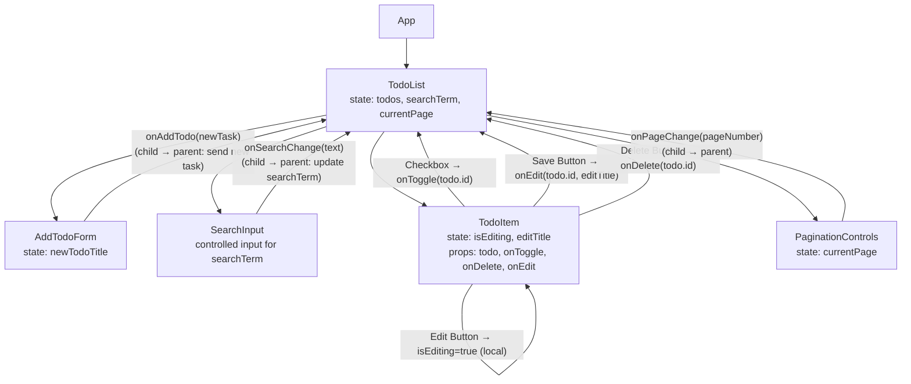

# Component Tree + Data Flow (simplified)

## Short Description

### TodoList App Structure

- **App**: Root component, renders TodoList.

- **TodoList**: Manages todos, searchTerm, and pagination state. Handles CRUD operations via useTodos hook.

- **AddTodoForm**: Allows adding new todos. Controlled input, lifts new todo to TodoList.

- **SearchInput**: Controlled input for searching todos by title. Updates parent state.

- **TodoItem**: Renders individual todo. Manages local edit state (isEditing and editTitle). Calls parent handlers for toggle, edit, and delete.

- **PaginationControls**: Handles page navigation. Updates currentPage state in parent.

## Data Flow

1. `useTodos` loads todos from API on mount (`fetchTodos` inside `useEffect`)

2. `TodoList` manages `searchTerm` and pagination (`currentPage`, `limitPerPage`)

3. Filtering is applied via `useEffect` in `useTodos` based on `searchTerm`

4. Pagination is handled in `TodoList` using `currentPage` and `limitPerPage` (API `skip`/`limit`)

5. `TodoList` passes todos and handlers (`addTodo`, `toggleTodo`, `deleteTodo`, `editTodoTitle`, `goToNextPage`, `goToPrevPage`) to child components (`AddTodoForm`, `SearchInput`, `TodoItem`, `PaginationControls`)

6. User interactions in children call parent handlers → local state is updated immediately

7. Optimistic updates: local state is updated first; API requests happen asynchronously. If API fails, local state may revert, and an error is displayed
